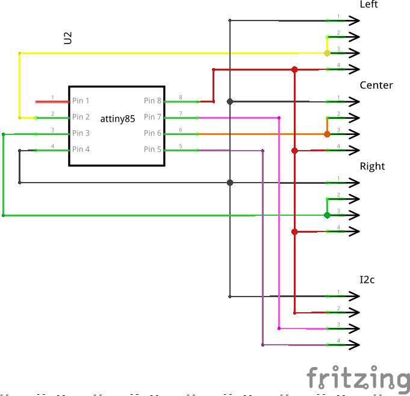

# Zuma Robot

**NOTA:** E' un "work in progress", il codice contiene parti temporanee, inutili, oscure e brutte. Usare con cautela.

Zuma è basato sul kit Pololu Zumo

[Link al kit](https://www.pololu.com/product/2509)

Il primo obiettivo è quello di avere un "robot" in grado di muoversi in autonomia evitando gli ostacoli, i suoi occhi sono i 3 sensori ad ultrasuoni

Il secondo è quello di avere la possibilità di pilotarlo da PC (tramite PyZuma) via Bluetooth, i sensori in questo caso evitano solo le collisioni frontali

Il terzo ancora non lo so ma ci sto montando una [action cam](https://github.com/nonzod/XproHacks) e quindi sarà qualcosa legato al riconoscimento facciale...

[Alcuni video di smanettamenti vari](https://www.youtube.com/playlist?list=PLJIxBVzDzd1Iara72QcWV6yH5hbcxgozS)

## Zumo Shield

[Librerie Zumo](https://github.com/pololu/zumo-shield)

### Pin riservati allo shield

**3**: the ZumoBuzzer library uses hardware PWM to play notes on the buzzer.

**7**: controls the right motor direction.

**8**: controls the left motor direction.

**9**: controls the right motor speed with PWM.

**10**: controls the left motor speed with PWM.

**12**: The user pushbutton is located on the rear edge of the shield. It is connected to digital pin 12 on the Arduino; pressing the button pulls the pin low, and we recommend enabling the Arduino’s internal pull-up to pull the pin high otherwise. The Pushbutton library, included with our Zumo Shield libraries, makes it easy to detect and debounce button presses with this pushbutton.

**13**: A yellow user LED is located on the right edge of the shield. It is connected to digital pin 13 on the Arduino, in parallel with the Arduino’s onboard user LED.

**A1**: The battery level jumper connects the Arduino’s analog pin 1 to a voltage divider circuit that allows you to monitor the Zumo’s battery voltage. This jumper is disconnected by default and can be connected by soldering a short length of wire between the two holes.

## Sensori dello shield

Questi sensori sono integrati nello zumo shield.

### LSM330 - Bussola e Accellerometro

[Libreria](https://github.com/pololu/lsm303-arduino)

Indirizzo I²C: 00111xxb (0011101b [1D] o 0011110b [1E])

[Esempio esteso per calibrazione e lettura](https://github.com/pololu/zumo-shield/blob/master/ZumoExamples/examples/Compass/Compass.ino)

### L3G - Giroscopio

[Libreria](https://github.com/pololu/l3g-arduino)

Indirizzo I²C: 110101xb (1101011b [6B] o 1101010b [6A])

[Video: Spiegazione sui datasheet Giroscopio e Bussola](https://www.youtube.com/watch?v=anMzEbbbrp8&list=PLUMWjy5jgHK30fkGrufluENJqZmLZkmqI)

## Altri sensori aggiunti

Questi sensori sono esterni allo shield.
Visto che i pin a disposizione sono pochi ho deciso di usare 3 HC-SR04 con un ATtiny85 per farli comunicare con arduino via I2c.

### Sensore ultrasuoni HC-SR04

[Tutorial](http://www.giuseppecaccavale.it/arduino/sensore-ad-ultrasuoni-hc-sr04-arduino/)

[Libreria NewPing](https://bitbucket.org/teckel12/arduino-new-ping/wiki/Home)

Lo schema del circuito che gestiste i sensori ad ultrasuoni:

### Adattatore Bluetooth 4 HM10

[SunFounder Bluetooth 4.0 HM-10](https://www.sunfounder.com/bluetooth-4-0-hm-10-master-slave-module.html)

Gestito su arduino con la libreria [SoftwareSerial](https://www.arduino.cc/en/Reference/softwareSerial)
